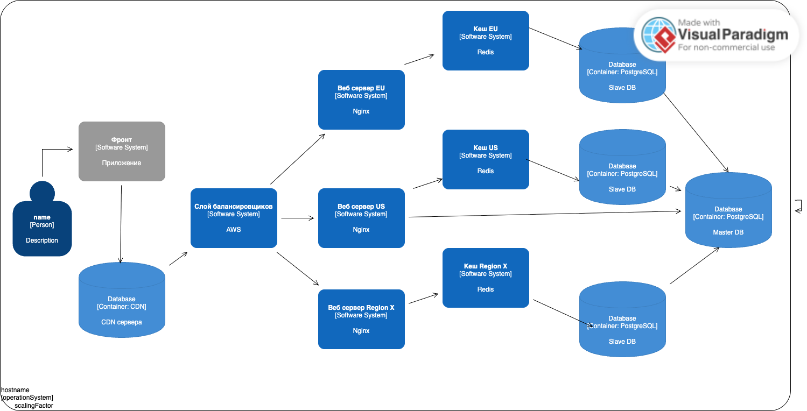

# Лабораторная работа №1

## Нечаев Игорь Сергеевич 334772

### Оценочные расчеты
* Количество новых записей в месяц:\
  10_000_000

* Количество чтений в месяц:\
  Каждую ссылку читают 100 раз\
  Пусть retention на 30 день 5%, для удобства пусть он не будет уменьшаться\
  Тогда 10_000_000 * 100 = 1_000_000_000 чтений новых ссылок за месяц\
  И каждый месяц добавляется 5% от предыдущего: 1_000_000_000 * 0.05 = 50_000_000 чтений

Срок действия ссылки 1 год\
1 год * 10_000_000 записей/мес = 12 месяц * 10_000_000 записей/мес = 120_000_000 записей\
Необходимую память рассчитаю после проектирования слоя данных


* QPS = чтение + запись\
  Запись = 10_000_000 / 30 / 24 / 3600 = 4 QPS * 2 (пик) = 8 QPS \
  Чтение = 4 QPS (от записи) * 100 * 4 (пик) + (11 * 50_000_000) / 30 / 24 / 3600 = 1800 QPS


### Проектирование API
Создание ссылки
```
--> POST base_url/api/v1\
{
  "long_url": "https://shop.best.shop/men/hat",
  "alias": "777", (nullable)
}

<--- 201, 409, 413
```

Получение ссылки
```
---> GET https://tinyclone.com/777?utm_source="Пост какой-то"

<-- 301 location https://shop.best.shop/men/hat, 404
```

### Модель данных
Обеспечиваю C для того чтобы один псевдоним или одна ссылка всегда указывала только на один оригинальный ресурс\
Для аналитики использую AP так как важна только eventual consistency\
```
erDiagram
	shorter_table {
                INT id PK
		VARCHAR(128) url 
                DATE expire_date
	}

        alias_table {
                VARCHAR(128) alias PK
		INT shorter_id FK
	}
	
	analytics_no_sql_table {
		INT shorter_id "номер ссылки"
        INT creator_id "номер создателя"
        INT description "описание назначения ссылки"
         VARCHAR(128) alias "псевдоним"
            INT click_count "количество кликов"
                DATE created_date "дата создания"
                STRING utms "данные о количестве переходов из разных источников"
                STRINGS ips "данные о регионах в которых ссылка популярна"
	}
```
**shorter_table**

Инкремент + счётчик

INT id PK - порядковый номер записи, он соответствует base62 записи которая будет коротким URL (4 байта)\
Буду использовать base62: 62^N >= 120_000_000 => N = 4.5074 -> 5 символов для hash_value

VARCHAR(128) url - полный URL (128 байт)

DATE expire_date (4 байта)\
Дата очистки, каждый месяц програмное расширение БД каскадно очищает ссылки которые были созданы с 13 по 12 месяцев назад

В кортеже 256 байт, максимум 120_000_000, 1 master и 10 slave с 5 шардами по остатку от деления INT id PK\
итого 120_000_000 * 11 * 256 байт = 337.92 гб

**alias_table**

VARCHAR(128) alias PK - сокращенный пользовательский URL\
INT shorter_id FK - внешний ключ записи из shorter_table\
INT click_count - количество переходов по кастомному URL\

топ 10_000_000 по click_count держу в Redis кеше в формате alias:shorter_id

256 байт * 10_000_000 = 2.56 гб -> 3 гб

**Итого 512 гб**\
SQL: read-heavy, умеренный write 100:1, строгая консистентность при создании ссылки, обеспечиваю CP

**analytics_no_sql_table**
Полезно хранить в NoSQL для каждой записи информацию о создателе, назначении, количестве обращений,\
гео в которых ссылка популярна для перемещения на ближайший сервер и использование geo CDN\
также храню название рекламных компаний в результате которых был осуществлен клик по сокращенной ссылке

### Технические решения
**Хэширование + Base62**\
\+ нет проблемы инкремента => легче горизонтальное масштабирование\
\- решать коллизии, соль, всегда относительно длинные ссылки

**Инкрементальный счётчик + Base62**\
\+ нет коллизий, ультракороткие коды для старта супер удобно\
\- решать проблему инкремента (например Twitter Snowflake ID)

**Кастомный псевдоним**\
Таблица alias_table содержит отношение всех псевдонимов, кеш содержит пары alias:shorter_id для часто используемых псевдонимов. По shorter_id вычисляется base62 hash_value. Если псевдоним занят отвечаем фронту 409

**Ускорение редиректа**\
CDN + Redis кеш с парами alias:shorter_id для часто используемых псевдонимов. Шардирование shorter_table по остатку от деления id.

### UML-диаграмма


### Анализ узких мест
Инкремент -> Snowflake\
Горизонтальное масштабирование -> consistent hashing\
Не популярные alias долго ищутся -> индекс по alias\
Негативное кеширование на фронтах
Рейт лимит на IP
Время синхронизации новой ссылки в мастере на слейвов -> для данного url ходить в master пока slave не синхронизировались\
Инкремент переходов сделать eventually consistence так как не нужна точность в моменте\